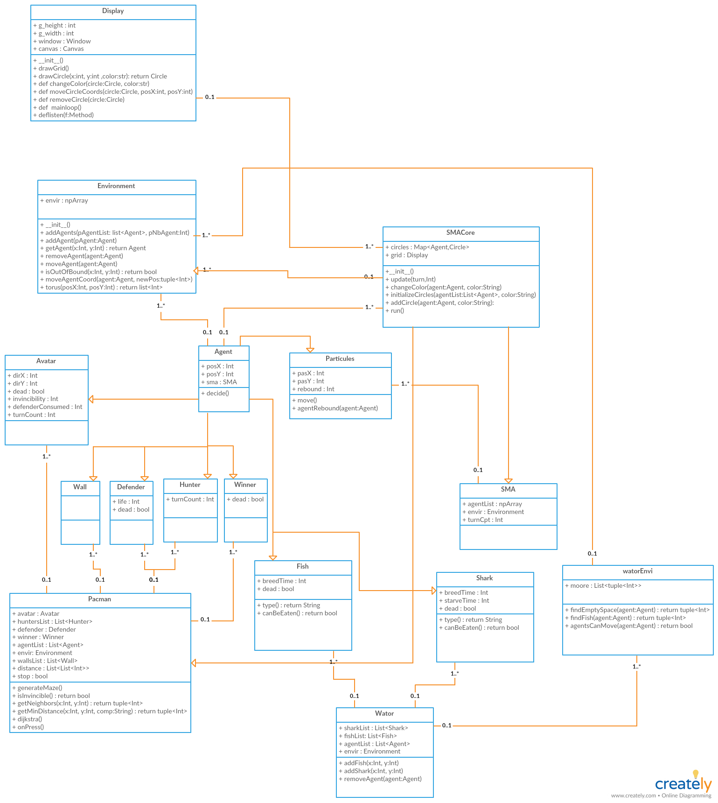
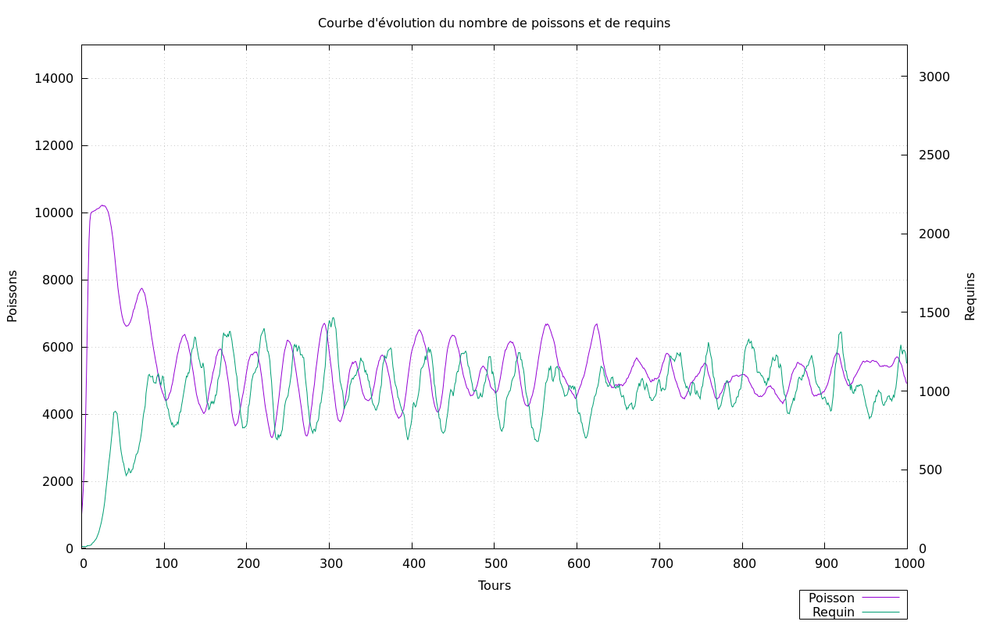
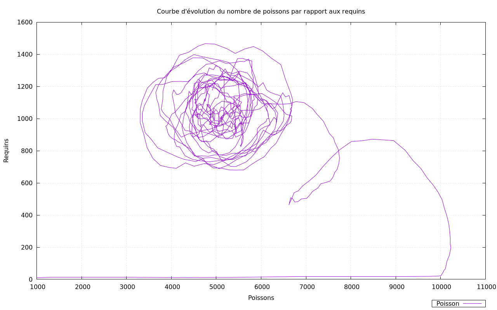
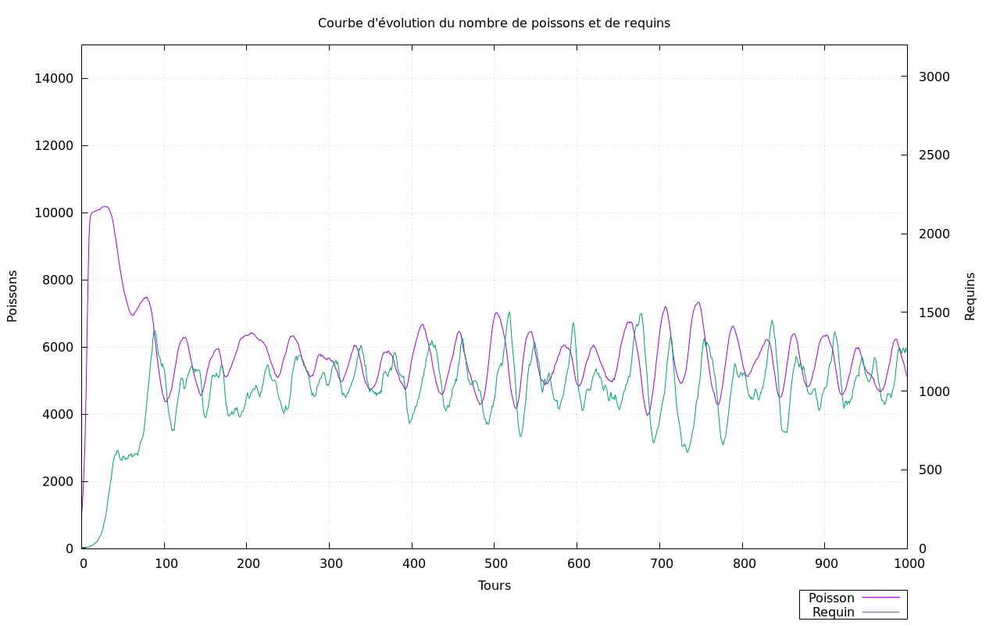

# SCI : Simulation Centrée Individu
# Axel Thavisouk

## Lancer les différentes parties

Le TP a été réalisé en langage python et l'interface graphique Tkinter il faut donc Tkinter(qui peut parfois ne pas être installé)

Pour lancer les différentes parties il faut exécuter le main correspondant:

Pour particules, lancez:
- python3 mainParticules.py

Pour Wator, lancer:
- python3 mainWator.py

Pour Pacman, lancez:
- python3 mainPacman.py

## Eléments de configurations en communs

- torus : 1 si torique, 0 sinon
- gridSizeX : nombre de cases en abscise
- gridSizeY : nombre de cases en ordonnées
- boxSize : la taille des cases
- scheduling : les ordonnancement(equitable,sequentiel,random)
- nbTicks : le nombre de tours (-1 pour infini0)
- grid : 1 pour afficher la grille, sinon 0
- trace : 1 pour avoir la trace, 0 sinon
- seed : mettre à null si pas de seed,
- refresh : délai entre chaque tours,

## Diagramme UML

## Partie particules

la partie particules est dans le package Particules. Il contient les fichiers suivants:

- Particules.py: Contient la classe de l'agent Particule
- sma.py: Contient le core de la partie particule
- parameter.json: le fichier de config de la partie particule

### Config

- nbParticules : le nombre de particules

### Questions

#### Questions 1

On peut faire tourner sur un ordinateur ayant un processeur Intel® Core™ i5-7200U CPU @ 2.50GHz × 4 et 8 Go de RAM
120000 particules qui bougent à une fréquence d'environ 1 tour/seconde

#### Question 2

#### Question 3
Dans le cas où l'on ne fait rien lorsque une bille est présente, on supprime les particules où l'on veut aller. si l'on utilise une seuxiéme grille tampon pour stocker les particules qui se font supprimer on peut contourner le problème et dans ce cas il n'y a plus aucune collision.

Dans le cas où j'inverse la direction lors d'une collision, j'ai eu d'abord des problèmes où certaines particules supprimaient d'autres qui étaient dans l'environnement, mais en utilisant la même solution qu'en ne faisant rien on obtiens des mouvement assez étrange car les particules que l'on rencontre ne sont donc pas du tout affectées par les collisions qui n'ont pas été réalisée par eux.

Le cas où l'on échange les pas des deux particules qui collisionnent est le comportement qui donne le meilleur rendu car en effet les deux particules sont dans ce cas affectée par la collision et il n'y a plus besoin de tableau tampons car il n'est plus possible d'avoir deux particules différentes sur la même case.

## Partie Wator

### Package

la partie Wator est dans le package Wator. Il contient les fichiers suivants:

- fish.py: Contient la classe de l'agent Fish
- shark.py: Contient la classe de l'agent Shark
- wator.py: Contient le core de la partie wator
- wator.json: le fichier de config de la partie wator
- watorEnvi.py: l'environement de Wator

### Config
- waterColor : La couleur du background
- fishColor : la couleur du poisson
- sharkColor : la couleur des requins
- newFishColor : la couleur des nouveaux poissons
- newSharkColor :la couleur des nouveaux requins
- fishBreedTime : temps de fécondation pour les poissons
- sharkBreedTime : temps de fécondation pour les requins
- sharkStarveTime : temps avant de mourir de faim pour les requins,
- nbShark : le nombre de requins
- nbFish : le nombre de poissons

### Questions

#### Question 1
Il est préférable d'initialiser les différents compteurs de manière aléatoire car lorsque l'on fixe ces compteurs aux même valeurs on obtiens des poissons et leurs enfants qui naissent et qui meurent en même temps. On peut le voir par la croissance en bloc sur la grille lorsque l'on le lance ainsi.

#### Question 2
Lorsque l'on fixe une action par tick on bloque lorsque la grille est remplie de poissons car il ne peuvent plus se reproduire car les poissons se seront reproduits là où les requins étaient avant

Se reproduire en bougeant donne le meilleur résultat, ils donnent aux requins une meilleure survie et les poissons se reproduisent assez rapidement aussi, on voit sur la courbe d'evolution que les poissons ont l'air de se stabiliser un peu mieux sur la fin

Se reproduire en mangeant ne permet pas aux poissons de stabiliser leurs populations comme le faisait le comportement précédent

## Partie Pacman

### Package

la partie Pacman est dans le package Pacman. Il contient les fichiers suivants:

- avatar.py: Contient la classe de l'agent avatar
- defender.py: Contient la classe de l'agent Defender
- hunter.py: Contient la classe de l'agent Hunter
- wall.py: Contient la classe de l'agent Wall
- winner.py: Contient la classe de l'agent Winner
- pacman.py: Contient le core de la partie pacman
- maze.json: le fichier de config de la partie pacman

### Config

- speedHunter : nombre de tour nécessaire pour le mouvement d'un hunter
- speedAvatar : nombre de tour nécessaire pour le mouvement de l'avatar
- nbHunter: nombre de hunter
- nbWall : pourcentage de mur, ignoré si maze à 1
- defenderLife : nombres de tours avant la disparition du defender,
- invincibility : nombre de tour de l'invincibilité,
- maze : 1 pour obtenir un labyrinthe, 0 sinon
- erosionLabyrinthe : un nombre entre 0 et 1 afin d'éroder le labyrinthe pour ne pas avoir qu'un seul chemin

### Les touches

- Les touches A et Z permettent d'accélérer et décélérer les Hunters
- Les touches O et P permettent d'accélérer et décélérer l'Avatar
- Les touches W et X permettent d'accélérer et décélérer le jeu
- La touche Espace permet de mettre en pause le jeu et de le reprendre
